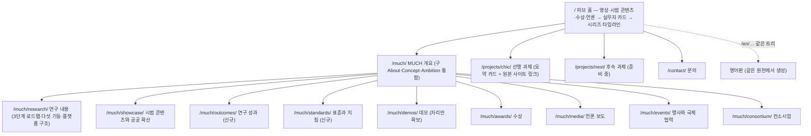

# PLAN — MUCH 홈페이지 리뉴얼 구현 계획

> G4.5(구현 계획) 산출물. 2026-09-10 작성했고 2026-09-11에 스택과 디자인 항목을 개정했다.
> 확정된 결정은 [[DECISIONS]], 생성기 선택 경위는 [[STACK-SURVEY]], 현행 사이트 분석은
> [[SITE-ANALYSIS]], 콘텐츠 원천은 [[REF-종료평가발표자료]]에 각각 있다.

## 1. 무엇을 왜 고치는가

현행 사이트(Google Sites, `sites.google.com/view/much0`)의 문제는 [[SITE-ANALYSIS]]에
실측으로 정리되어 있다. 요지는 네 가지다.

1. 2025년 12월에 끝난 과제를 여전히 현재형으로 서술한다.
2. 논문·특허·표준·데이터셋처럼 **인용할 수 있는 성과가 하나도 실려 있지 않다.**
   그 성과는 종료평가 발표자료에만 담겨 있다.
3. 설명 태그와 그림의 대체 텍스트가 비어 있어 검색에도 읽기 보조 도구에도 잡히지 않는다.
4. 한국어판과 영어판이 별도 사이트로 복제되어 이미 내용이 어긋나 있다.

여기에 더해 Google Sites는 자바스크립트를 넣지 못하므로 3차원 뷰어나 지식그래프
탐색기 같은 데모를 애초에 심을 수 없다.

**범위 밖**: 데모 자체의 개발은 자리만 확보하고 별도 작업으로 분리한다.
기관 도메인 연결과 접속 통계 도구는 배포 뒤에 따로 확인한다.

## 2. 무엇으로 만드는가

| 항목 | 값 | 근거 |
|---|---|---|
| 생성기 | Astro. 버전과 Node 버전은 CHIC 저장소에 맞춘다 | [[DECISIONS#P0-3. 정적 사이트 생성기 — Astro (Hugo 결정을 뒤집음)\|P0-3]] |
| 저장소 | `ETRI-ULSOO/much-site` (비공개로 시작해 배포 시 공개) | [[DECISIONS#P0-4. 저장소 구조 — 별도 저장소 `ETRI-ULSOO/much-site`\|P0-4]] |
| 공개 주소 | `https://etri-ulsoo.github.io/much-site/` | 같은 항목 |
| 디자인 | 사용자가 직접 만들어 넘긴다. Claude는 토큰으로 옮겨 구현한다 | [[DECISIONS#P1-2. 디자인 — 사용자가 직접 만들어 넘기고, 구조만 CHIC에서 물려받는다\|P1-2]] |

**CHIC에서 가져오는 것**: 이중언어 라우팅 구조, 하위 경로 헬퍼(`withBase`·`stripBase`),
배포 워크플로, 본문은 Markdown이고 표는 YAML로 가르는 방식, 컴포넌트가 받는 속성의 짜임새.
**가져오지 않는 것**: 색·서체·간격 토큰과 컴포넌트의 외형.

### 2.1 사용자가 넘겨주어야 원고가 완성되는 항목

없으면 해당 절이 "준비 중"으로 남는다. [[DECISIONS#미결 항목|DECISIONS 미결 항목]]과 짝을 이룬다.

| 항목 | 쓰이는 곳 | 없을 때 |
|---|---|---|
| 논문·특허·프로그램 등록의 서지 정보 | `/much/outcomes/` | 발표자료의 합계 숫자만 싣는다 |
| 「문화유산 디지털 애셋 표준 가이드라인 2024」 등 문서 파일 | `/much/standards/` | TTA 표준은 TTA 사이트로 링크만 건다 |
| 언론 보도 20여 건의 기사 주소와 일자 | `/much/media/` | 현행 9건을 제목만으로 유지한다 |
| 시연 영상의 게시 계정과 영상 번호 | 영상 전체 | 올리지 않은 영상은 게시를 미룬다 |
| 후속 과제의 이름·기간·소개 | 홈 타임라인 | "준비 중" 카드로 둔다 |
| 문화유산기술연구소의 컨소시엄 포함 여부 | `/much/consortium/` | 수상 페이지의 표기를 따른다 |
| 문의 방식 | `/contact/` | 주소를 그대로 노출하지 않고 가공해 싣는다 |

## 3. 정보 구조



홈의 두 층 구성은 [[DECISIONS#P1-1. 1차 독자 — 박물관 실무자와 일반 대중을 함께|P1-1]]에 적혀 있다.
발표자료의 어느 장이 어느 절로 가는지는 [[REF-종료평가발표자료]] 3절과 7절이 원천이다.

## 4. 단계별 작업

각 단계는 새 세션에서 산출물만 넘겨 시작한다. 컨텍스트를 깨끗하게 유지하기 위해서다.

### 0단계 — 결정 고정과 저장소 준비 ✅ 2026-09-11 완료

`.gitignore`와 `git init`, [[DECISIONS]], [[STACK-SURVEY]], [[REF-종료평가발표자료]],
`tools/`(발표자료 추출 스크립트와 용량 검사), 이 문서의 개정까지 마쳤다.

검증 결과: 7.1 GB 발표자료가 추적 대상에 오르지 않음을 확인했고, 로컬 커밋 이메일을
업무 계정으로 지정했다.

### 1단계 — 한국어 원고와 데이터 정리 (코드 없음)

- `src/content/` 아래에 페이지별 Markdown 초안 13개를 쓴다.
  [[REF-종료평가발표자료]]와 현행 사이트 문장을 옮기되, [[SITE-ANALYSIS]]가 찾아낸
  **오류 11건을 전부 고친다** (현재형을 과거형으로, 근거 없는 최상급과 예측 수치 삭제,
  오탈자, 중복된 제목, 기관 표기 통일, 영어 메뉴를 한국어로).
- `src/data/` 아래에 YAML 12개를 만든다: 정량 성과, 논문, 특허, 소프트웨어, 데이터셋,
  표준, 수상, 언론, 행사, 영상, 시리즈 타임라인, 컨소시엄.
  표시되는 모든 문자열은 `ko`와 `en` 두 키를 갖되 영어는 이 단계에서 비워 둔다.
- 그림에 붙일 **대체 텍스트를 원고 안에 함께 쓴다.** 현행 사이트의 대체 텍스트는 0퍼센트다.
- 사용자 검수 1회: 정량 수치가 발표자료와 맞는지, 고친 문구가 사실과 어긋나지 않는지.

검증: 오류 11건 정정 체크표, YAML 파싱 통과, 수치 대조표.

### 2단계 — 디자인 받기와 토큰화 (2026-09-11 성격 변경)

사용자가 디자인을 직접 만들어 넘긴다. Claude는 시안을 제시하지 않는다.

- 넘겨받은 결과물을 읽어 색·서체·간격 토큰으로 정리하고 [[DESIGN]]에 고정한다.
- 결과물에 없는 값(누른 상태, 포커스 표시, 오류 색, 모바일에서의 간격 등)을
  **목록으로 만들어 한 번에 되묻는다.** 하나씩 물어 흐름을 끊지 않는다.
- 접근성 세 가지를 확인하고 어긋나면 보고한다: 본문 대비비 4.5:1 이상, 한글에
  대문자 변환과 넓은 자간을 쓰지 않기, 진한 악센트 색을 밝은 배경의 본문 글자에 쓰지 않기.

**이 단계는 1단계와 3단계를 막지 않는다.** 원고 정리와 뼈대 구축은 디자인이 오기 전에도
진행하며, 토큰은 나중에 갈아 끼운다.

### 3단계 — Astro 뼈대

```
astro.config.mjs          site·base·이중언어 라우팅·구 사이트 주소 넘김
package.json, .nvmrc      CHIC과 같은 Node 버전
src/pages/[locale]/       §3 트리. 페이지 파일을 언어별로 복제하지 않는다
src/content/              1단계 원고 (ko·en 같은 파일 이름)
src/data/*.yaml           1단계 데이터
src/i18n/ui.ts            메뉴와 버튼 같은 화면 문자열
src/layouts/BaseLayout.astro   제목·설명·공유 카드·대체 언어 링크·구조화 데이터
src/components/           그림·영상·수치·타임라인·도해
src/lib/url.ts            withBase·stripBase (CHIC에서 가져온다)
src/styles/tokens.css     2단계 산출물
public/.nojekyll          없으면 GitHub Pages가 빌드 산출물을 무시한다
tools/                    check_size.sh, check_i18n.py, 발표자료 추출
.github/workflows/deploy.yml   main에 push하면 배포
```

- `tools/check_i18n.py`: 한국어와 영어의 파일 집합, YAML의 `ko`·`en` 키 짝을 비교해
  빠진 것이 있으면 실패로 끝낸다. 배포 과정에서 실행해 **두 언어가 어긋나는 일을
  구조로 막는다.** 현행 사이트가 겪은 문제가 바로 이것이다.
- 영상은 누르기 전에는 불러오지 않는다. 현행 결과물 페이지는 삽입 창 11개를
  한꺼번에 불러온다.

검증: 빌드 성공, 개발 서버에서 언어 전환 확인, `check_i18n.py` 통과, 첫 배포 성공.

> 2026-09-11 실측: 빌드·언어 전환·`check_i18n.py` 세 가지 통과. 첫 배포는 push 뒤 확인. 홈을 뺀 쪽은 네 파일 대신 `[...slug].astro` 하나로 만들었다 ([[WORKLOG]] 3단계 절).

### 4단계 — 페이지 옮기기와 영어판

1단계 원고를 페이지에 반영하고, 영어판은 현행 영문 사이트의 문장을 우선 재사용하되
새로 쓴 절(성과·표준·확산)은 번역 초안을 만들어 사용자 검수를 받는다.
페이지 사이의 이전·다음 링크, 404 페이지, 구 사이트에서 오는 주소 넘김을 함께 넣는다.

검증: `check_i18n.py` 통과, 깨진 링크 0건, 페이지마다 설명과 공유 이미지 존재.

### 5단계 — 그림·영상·문서

- **그림**: 발표자료에서 꺼낸 것을 긴 변 2000픽셀로 줄이고, 사진은 JPEG로 도식은 PNG로
  넣는다. 현행 사이트의 그림은 Google이 다시 압축한 것이므로 발표자료 원본을 우선한다.
- **영상**: [[REF-종료평가발표자료]] 5절의 길이와 현행 YouTube 영상의 길이를 대조해
  번호를 채운다. 맞지 않는 것은 사용자가 확인하거나 게시를 미룬다. 홈의 배경 영상은
  소리 없는 `media10`이나 `media12`를 8초에서 10초로 잘라 5 MB 아래로 만든다.
  **`media2`(2.7 GB)와 `media15`(1 GB)는 저장소에 넣지 않는다.**
- **문서**: 지침 문서는 저장소에 넣고, TTA 표준은 외부 링크로 건다.

검증: 정적 파일 합계 100 MB 이하, `check_size.sh` 통과, 모든 그림에 대체 텍스트가 있음.

### 6단계 — 점검과 배포

두 컴퓨터의 빌드 결과를 비교하고, 배포된 주소를 브라우저로 훑는다(가로 375픽셀에서
넘침 없음, 언어 전환, 영상 지연 로드, 내려받기 링크). 접근성과 검색 점수를 재고,
사용자 승인을 받아 저장소를 공개로 바꾼 뒤 구 사이트에 이전 안내를 올린다.

## 5. 성공 기준

| 기준 | 확인 방법 |
|---|---|
| 발표자료와 영상이 저장소에 없다 | `git ls-files`에서 해당 확장자 0건, `check_size.sh` |
| 두 언어가 어긋나지 않는다 | `check_i18n.py`가 배포 과정의 필수 단계다 |
| 오류 11건을 고쳤다 | 1단계 체크표 전건 확인 |
| 정량 성과가 발표자료와 같다 | `stats.yaml`과 `image106` 대조표 |
| 대체 텍스트가 모든 그림에 있다 | 빌드 때 검사하고, 브라우저에서 확인 |
| 모바일과 성능 | 375픽셀 실측, 처음에 불러오는 영상 창 0개 |
| 두 컴퓨터에서 같은 결과 | Node와 Astro 버전 고정, 산출물 비교 |

## 6. 위험과 대비

- **디자인 결과물이 늦게 오는 경우**: 1단계와 3단계가 2단계에 묶여 있지 않으므로
  기본 스타일로 뼈대를 세워 두고 토큰만 나중에 갈아 끼운다.
- **하위 경로에서 링크가 깨지는 경우**: 내부 링크를 모두 `withBase()`에 통과시키고
  배포 과정에서 링크를 검사한다. 기관 도메인을 붙이면 설정 한 줄로 되돌린다.
- **영상의 정체를 확인하지 못하는 경우**: 대표 화면이 검은 넉 편이 해당한다.
  사용자에게 제목을 확인하고, 확인되지 않으면 게시하지 않는다.
- **기관의 외부 사이트 운영 정책**: 비공개 저장소로 시작하고, 공개로 바꾸기 전에
  사용자가 기관에 확인한다.
- **데모 자산의 용량**: 이번 범위 밖이다. 필요해지면 외부 저장소를 쓰거나 100 MB
  아래의 파일만 넣는다.
