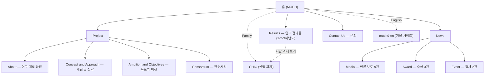

# MUCH 현행 사이트 분석 — 리뉴얼 착수 조사

> **대상**: [https://sites.google.com/view/much0](https://sites.google.com/view/much0) (한국어) ·
> [https://sites.google.com/view/much0-en/](https://sites.google.com/view/much0-en/) (영어판)
> **실측일**: 2026-09-10 · **방법**: 앱 내 브라우저에서 DOM을 직접 추출(페이지 구조·iframe·링크·
> 반응형 실측)하고, 페이지 본문은 WebFetch로 보강했다. `curl`은 샌드박스에서 거부되어 쓰지 않았다.
> **신뢰도 표기**: 실측(직접 확인) / 인용(출처 존재) / 추정(검증 안 됨). 표기가 없는 사실은 실측이다.
> **미측정 항목**: 페이지 전송량(네트워크 로그가 비어 있어 측정 불가), Lighthouse 점수, 페이지별
> 마지막 갱신 일자(Google Sites 푸터의 갱신 시간 버튼이 스크립트로 열리지 않음).
> 진행 기록은 [[WORKLOG]] 참조.

---

## 1. 요약 — 리뉴얼 판단에 영향을 주는 사실 6가지

1. **과제가 이미 종료된 상태의 "진행형" 사이트다.** 홈 문구는 "2023년 04월부터 2025년 12월까지
   수행되는 과제"라고 현재형으로 쓰여 있고, 마지막 행사 기록은 2025-09-05이다 (2026-09-10 기준
   종료 후 8개월 경과). 리뉴얼의 첫 결정은 사이트의 정체성(성과 아카이브 / 후속 과제 허브 /
   플랫폼 제품 사이트)이며, 이것이 정보 구조 전체를 결정한다 (§9 P0-1).
2. **콘텐츠 자산은 풍부하지만 전부 '보여주기'형이다.** 유튜브 삽입 19개, 이미지 약 60개, 수상 3건,
   언론 보도 9건이 있으나 **논문·특허·SW 등록·데이터셋·표준 문서 등 내려받거나 인용할 수 있는
   산출물이 하나도 없고, 실제 MUCH 플랫폼(서비스)으로 가는 링크도 없다.**
3. **검색·공유·접근성 기반이 비어 있다.** 메타 설명·OG 태그 없음, 타이틀은 "MUCH" 한 단어,
   홈 이미지 14장 전부 alt 없음, Google Analytics 미연결. 외부에서 이 사이트를 찾거나 공유할 때
   아무 정보도 실리지 않는다.
4. **이중언어를 별도 사이트 복제로 운영해 이미 내용이 어긋났다.** 영어판 결과물 페이지에는 "Conversion
   and management DB configuration design" 항목이 있으나, 한국어판은 같은 자리에 "W3C 시맨틱웹
   표준 구성 설계"가 중복 기재되어 있다 (복사 오류). 단일 원천에서 두 언어를 생성하는 구조가 필요하다.
5. **Google Sites의 구조적 한계가 리뉴얼 동기와 직결된다.** 커스텀 CSS/JS 불가(3D Gaussian Splatting
   뷰어·지식그래프 탐색기 같은 인터랙티브 데모를 직접 넣을 수 없음), 메타 태그 제어 불가, 버전 관리
   없음, 푸터의 Google Sites 브랜딩 제거 불가.
6. **반응형은 문제없다.** viewport 메타 정상, 모바일(375px)에서 가로 넘침 없음, 햄버거 메뉴 동작.
   현행 사이트에서 유지할 가치가 있는 것은 "구조(페이지 트리)와 콘텐츠 원문"이지 시각 디자인이 아니다.

---

## 2. 사이트 개요

| 항목 | 실측값 |
|------|--------|
| 플랫폼 | Google Sites (신형). 커스텀 도메인 미사용 (`sites.google.com/view/much0`) |
| 언어 | 한국어 본 사이트 + 영어 별도 사이트(`much0-en`, 하위 페이지까지 전부 번역됨) |
| 자매 사이트 | CHIC — 선행 과제 "실감형 문화유산 체험을 위한 애셋 기반 지능형 큐레이션 및 서비스 운영기술 개발" ([https://sites.google.com/view/intelligent-curation/](https://sites.google.com/view/intelligent-curation/)). 상단 메뉴 "Family"와 결과물 페이지 하단에서 상호 링크 |
| 과제 정보 | 문화체육관광부 문화기술 연구개발 지정 과제, 2023-04 ~ 2025-12, "문화유산 디지털 표준 선도를 위한 지능형 헤리티지 공유 플랫폼 기술 개발" |
| 참여 기관 | 문화체육관광부, 국립중앙박물관(수요처), 한국전자통신연구원(주관), 한국전통문화대학교, 중앙대학교 + 수상 페이지에 TRIC(문화유산기술연구소)가 공동연구기관으로 등장 (컨소시엄 페이지 목록에는 없음 — §7) |
| 연락처 | ETRI 콘텐츠연구본부 콘텐츠융합연구실, 3인의 이메일이 평문 노출, 주소 + Google Maps 삽입 |
| 분석 도구 | 없음 (gtag·dataLayer·GTM 스크립트 모두 부재) |
| 파비콘 | 커스텀 이미지 있음 (기와 지붕 로고) |

---

## 3. 정보 구조 (IA)

- 총 10개 페이지, 깊이 2단. 메뉴 라벨은 한국어 사이트에서도 전부 영어(Project, Results, News,
  Contact Us)이며, 페이지 안의 제목은 한국어다.
- 각 페이지 하단에 "Learn More" 버튼으로 다음 페이지를 잇는 **선형 안내 동선**(About → Concept →
  Ambition → Consortium → Results → News → Contact)이 있다. 리뉴얼에서 유지할 가치가 있는 장치다.

### 페이지별 실측 지표

| 페이지 | 경로 | 이미지 | iframe | 비고 |
|--------|------|:------:|:------:|------|
| 홈 | `/view/much0` | 14 | 1 (YouTube 과제 소개) | 25개 섹션. 모바일 세로 9,386px |
| About | `/project/about` | 4 | 0 | 연구 목표·내용·활용·기대효과 4단 |
| Concept | `/project/concept-and-approach` | 4 | 0 | 차별화 전략 4항목 |
| Ambition | `/project/ambition-and-objectives` | 2 | 0 | 이미지 2장이 내용의 전부 |
| Consortium | `/project/consortium` | 5 | 0 | 체계도 2 + 기관 로고 |
| Results | `/results` | 13 | 11 (YouTube) | 3개년 성과. 가장 무거운 페이지 |
| Media | `/news/media` | 5 | 7 (YouTube) | 기사 원문 링크 없음 |
| Award | `/news/award` | 6 | 0 | 외부 링크 3 (매경·iF·Red Dot) |
| Event | `/news/event` | 5 | 0 | 콜로키움 2회 |
| Contact | `/contact-us` | 3 | 1 (Google Maps) | |

> 세로 길이는 브라우저의 `scrollHeight` 보고값이 섹션 높이 합계와 크게 어긋나(홈: 섹션 합 약 7,000px
> 대 보고값 51,034px) 신뢰할 수 없어 표에서 제외했다. 모바일 실측값 9,386px만 유효하다.

---

## 4. 페이지별 콘텐츠 인벤토리

### 4.1 홈 (25개 섹션)
1. 히어로: "MUCH (Multi-purpose Universal Cultural Heritage)" + 과제 한 문단 + 광개토대왕릉비 흑백 사진
2. 과제 소개: YouTube 1편 (`nJ_bwRA2z98`)
3. 프로젝트 개요: 이미지 1장 (텍스트 없음)
4. 연구 개발의 필요성: 카드 6장 — 기술성 / 사회성 / 경제성 / 문화성 / 산업성 / 정책성. 각 카드는
   제목 + 근거 3줄 + 배경 이미지
5. 활용 방안: 카드 4장 — 향유 환경 / 콘텐츠 제작 데이터 / 데이터 패브릭 플랫폼 / 박물관 관리 시스템
6. CTA: "Go to check the process — Learn More" → About

### 4.2 Project 4페이지
- **About**: 연구 목표(1문장 + 3항목), 연구 내용(6항목: 데이터 패브릭 설계, 지식그래프 플랫폼, AI
  가시화, 헤리티지 특화 서비스, 데이터셋 구축, 생성형 AI 응용), 연구 결과 활용(3항목),
  기대 효과(경제산업·기술·문화 3분류)
- **Concept**: 차별화 전략 4항목 — 데이터 패브릭 기반 아카이브 / 디지털 헤리티지 표준 / 데이터
  가시화 기술 / 지능형 공유 플랫폼 + 연구 개발 차별화 전략 도식 1장
- **Ambition**: "현재 상황 및 목표" 이미지 1장. 텍스트 설명이 없어 **이미지가 깨지면 페이지가 비는 구조**
- **Consortium**: 활동 체계도 + 역할도 + 기관 5곳 로고

### 4.3 Results (핵심 페이지)
- **연차별 활용 계획도** 이미지
- **3차년도 (2025)**: MUCH 플랫폼 / 인공지능 연구결과 기능구현 / 3D Gaussian Splatting / 지능형
  관계기반 시각화 / MUCH 지식그래프 / 인공지능기반 동선안내 / 반가사유상 시범콘텐츠 — **7항목 전부
  YouTube 영상만 있고 텍스트 설명이 없다**
- **2차년도 (2024)**: AI 모델 기반 연관성·추천 이미지 분류 / 지능형 문화유산 플랫폼 / 지식그래프
  데이터 탐색 / 문화유산 기반 AI 활용 결과물 — 4항목, 역시 영상만
- **1차년도 (2023)**: W3C 시맨틱웹 표준 구성 설계 / (변환 및 관리 DB 구성 설계 — 제목 누락) /
  데이터 유형 분류 / 메타데이터 설계 / 계층구조 기반 관계 가시화 / 가시화 서비스(키워드 검색·카탈로그
  내비게이션·SPARQL) / 아카이브 기반 가시화 / CNN 이미지 변환 / 애셋 데이터 최적화(유물 56건 66점:
  3D 60점·RTI 15점·기가픽셀 5점, glTF→Nexus 재압축) — 9항목, 이미지 + 한 줄 설명
- **지난 과제 보기**: CHIC 링크
- 정량 지표는 1차년도 애셋 취득 수치가 유일하다. 논문·특허·SW 등록·표준 기고·데이터셋 공개 항목 없음.

### 4.4 News 3페이지
- **Media (9건)**: KBS, SBS, 대전MBC, TJB, TV조선, 연합뉴스 2건, 충청투데이, 디지털타임스.
  YouTube 7편 삽입, **기사 원문 URL은 하나도 없음**. 보도 일자 표기 없음
- **Award (3건)**: 2024 IDEA Design Award 본상(디지털 광개토대왕릉비, 국립중앙박물관·TRIC),
  2023 iF Design Award Winner(인천공항 T1 반가사유상 미디어아트), 2023 Red Dot Winner(평생도).
  외부 링크 3개 정상
- **Event (2건)**: 2024 지능형 헤리티지 콜로키움(2024-09-10 경주 화백컨벤션센터),
  2025 공존과 지속 콜로키움(2025-09-05 광주 김대중컨벤션센터). 발표 자료·프로그램 링크 없음

### 4.5 Contact
- 담당자 3인 이름·이메일 평문, 주소, Google Maps 삽입. 문의 양식 없음

---

## 5. 시각 디자인·UX 관찰 (스크린샷 2장: 데스크톱 홈 상단, 모바일 홈 상단)

- **테마**: Google Sites 기본 테마 계열. 본문 서체 Lato(제목)·Roboto/Google Sans(UI), 주조색 남색
  `rgb(63,81,181)`(#3F51B5, Material Indigo 500), 배경 흰색·연회색 `#F2F2F2`, 오버레이 `rgba(32,33,36,.75)`.
  **과제 고유의 시각 정체성(색·서체·로고 체계)이 없고** 템플릿 기본값 그대로다.
- **히어로**: 왼쪽 텍스트 + 오른쪽 흑백 유리건판 사진(광개토대왕릉비). 사진 자체는 강한 소재이나
  본문 서체·색과 어울리는 편집이 없다.
- **필요성 카드 6장**: 같은 높이(약 267px)의 배경 이미지 카드에 흰 글자를 얹은 형태. 정보 밀도가
  낮고 스크롤이 길다. 카드 배경 이미지의 alt가 없어 스크린리더에는 제목만 남는다.
- **결과물 페이지**: 영상 11개를 세로로 나열. 연차 구분이 제목뿐이라 3개년 흐름이 한눈에 보이지 않는다.
  타임라인·필터(연차·주제)·썸네일 그리드 같은 탐색 장치가 없다.
- **모바일**: 스택 레이아웃으로 정상 전환. 히어로 본문 16px, H1 32px.
- **동선**: 각 페이지 말미의 "Learn More" 선형 안내는 처음 방문한 심사위원·기자에게 유효하다.
  반면 사이트 내 검색(Google Sites 기본)은 있으나 결과물 필터는 없다.

---

## 6. 기술·품질 실측

| 영역 | 실측 결과 | 판정 |
|------|-----------|------|
| 반응형 | viewport 메타 정상, 375px에서 가로 넘침 없음, 햄버거 메뉴 동작 | 양호 |
| SEO | `<title>` "MUCH" 단일어, meta description 없음, OG 태그 없음, canonical 없음, 구조화 데이터 없음 | 미비 |
| 접근성 | 홈 이미지 14/14 alt 공백, 카드 정보가 배경 이미지에 의존, 건너뛰기 링크는 존재 | 미비 |
| 분석 | GA/GTM 없음 — 방문·유입 데이터가 전혀 없다 | 없음 |
| 성능 | 미측정 (네트워크 로그 확보 실패). 정황: 결과물 페이지 YouTube iframe 11개 동시 로드, 언론 페이지 7개 | 추정: 무거움 |
| 보안·개인정보 | 이메일 3건 평문 노출(스팸 수집 대상), 문의 양식 없음 | 개선 필요 |
| 다국어 | 별도 사이트 복제. 결과물 페이지에서 이미 제목 불일치 발생 | 구조적 위험 |
| 버전 관리 | 없음 (Google Sites 편집 이력만) | 2대 환경 Git 동기화 원칙과 불일치 |

---

## 7. 콘텐츠 오류·불일치 목록 (리뉴얼 시 원문 정정 대상)

| # | 위치 | 문제 | 근거 |
|---|------|------|------|
| 1 | Results 1차년도 | H2 "W3C 시맨틱웹 표준 구성 설계" 2회 중복. 두 번째는 "변환 및 관리 DB 구성 설계"여야 함 | 영어판 동일 위치 "Conversion and management DB configuration design" |
| 2 | Results 1차년도 | "문화유산 애셋 데이터 최적" 제목 미완(최적화), "gITF" 오기(glTF) | 원문 |
| 3 | Award | "Communication Desing" 오탈자, "콘텐츠가세계" 띄어쓰기 | 원문 |
| 4 | 홈 히어로 | "2025년 12월까지 수행되는" 현재형 — 종료 과제 | 과제 기간 |
| 5 | 홈 필요성 카드 | "글로벌 데이터 처리량은 2025년 175ZB까지 증가할 것으로 예상" 등 시점 지난 예측 수치, 출처 없음 | 원문 |
| 6 | 홈 활용 방안 | "세계 최초 인공지능 기반 데이터 생성·가공·변환 플랫폼" — 근거 없는 최상급 표현 | 원문 |
| 7 | 홈 CTA·메뉴 | "Go to check the process / Learn More", 메뉴 전체 영어 — 한국어 사이트 내 언어 혼용 | 원문 |
| 8 | Consortium vs Award | 컨소시엄 기관 목록에 TRIC(문화유산기술연구소)가 없으나 수상 페이지는 "공동연구기관 TRIC"으로 기재 | 두 페이지 대조 |
| 9 | Media | 기사 원문 링크·보도 일자 없음 | 링크 실측 0건 |
| 10 | Ambition | 텍스트 없이 이미지 1장 — 검색·번역·접근성 전부 불가 | DOM |
| 11 | 전체 | 이미지 alt 전무 | DOM |

---

## 8. Google Sites 플랫폼 제약 — 리뉴얼 동기와의 연결

| 제약 | 리뉴얼에서 하고 싶은 일과의 충돌 |
|------|----------------------------------|
| 커스텀 CSS/JS 불가 | 3D Gaussian Splatting 뷰어, 지식그래프 탐색기, 반가사유상 콘텐츠 같은 **인터랙티브 데모를 페이지 안에 직접 넣을 수 없다** (외부 호스팅 후 iframe만 가능) |
| `<head>` 제어 불가 | meta description·OG·구조화 데이터·다국어 hreflang 설정 불가 |
| 분석 | GA 연결만 가능 (현재 미연결) |
| 다국어 | 사이트 복제뿐 — 드리프트 발생 (§7 #1) |
| 버전 관리·협업 | Git 없음, 리뷰 없음, 2대 환경 동기화 원칙과 불일치 |
| 브랜딩 | 푸터 "Google Sites / 불건전 게시물 신고" 제거 불가 |
| 커스텀 도메인 | 가능하나 미사용 (인용·명함·논문 기재용 짧은 주소 없음) |
| 이미지 | 업로드 시 Google이 재인코딩·축소 — 원본 해상도 자산은 사이트 밖에 있어야 한다 |

---

## 9. 리뉴얼 관점의 사각지대 (G1 — 사용자에게 물어야 할 것)

사용자는 이 과제의 수행자(연락처 페이지 기재)이므로 도메인·콘텐츠에 대한 사각지대는 없다.
사각지대는 **리뉴얼의 목표 정의**에 있다. 폭발 반경 순으로 정렬한다.

| 우선순위 | 질문 | 왜 먼저인가 | 추천안 |
|:--------:|------|-------------|--------|
| **P0-1** | 리뉴얼 후 사이트의 정체성은? ⓐ 종료 과제 성과 아카이브 ⓑ 후속 과제(예: ULSOO 계열)와 이어지는 살아있는 연구 허브 ⓒ MUCH 플랫폼 제품·서비스 사이트 | 정보 구조·톤·홈 구성이 전부 달라진다. ⓐ는 성과 중심 타임라인, ⓑ는 과제 시리즈 구조, ⓒ는 기능·데모 중심 | 과제가 종료됐고 자매 사이트(CHIC)와 "Family" 관계가 이미 있으므로 **ⓑ(과제 시리즈 허브) 안에 ⓐ(MUCH 성과 아카이브)를 담는 구조**를 추천. ⓒ는 실제 서비스 URL이 있을 때만 |
| **P0-2** | 호스팅·스택은? Google Sites 안에서 재디자인 vs 정적 사이트(GitHub Pages 등)로 이관 | 작업 폴더가 비어 있고 이름이 `Much-site`라 정적 사이트 구축으로 추정되나, ETRI의 외부 호스팅·도메인 정책과 기관 검수 절차가 변수 | §8의 제약이 동기라면 **정적 사이트 생성기 + Git 관리 + GitHub Pages**를 추천. 계정은 ETRI-ULSOO 소유로 (전역 규칙의 계정 구분) |
| P1-1 | 1차 독자는? 심사·평가단 / 박물관 실무자 / 콘텐츠 기업 / 일반 대중 / 해외 연구자 | 홈 첫 화면과 결과물 페이지의 깊이가 달라진다 | 심사·평가단과 박물관 실무자를 1차로 두고 영어판은 해외 연구자용으로 |
| P1-2 | 원본 자산을 보유하는가? 이미지·영상 원본, 다이어그램 소스, 논문·특허·SW등록·표준 기고 목록, 플랫폼 데모 URL | 산출물 목록이 없으면 결과물 페이지는 지금과 같은 "영상 나열"에 머문다 | 리뉴얼 착수 전에 산출물 목록(연차별 논문·특허·SW·표준·데이터셋)을 먼저 확보 |
| P1-3 | 이중언어 유지 방식 — 단일 원천에서 두 언어 생성 vs 지금처럼 분리 | 분리 운영이 이미 불일치를 만들었다 | 단일 원천(콘텐츠 파일에 ko/en 병기) + hreflang |
| P2 | 커스텀 도메인, GA 연결, 연락처 노출 방식(양식 vs 이메일), 푸터 기관 표기 | 구조에 영향 없음 | 도메인은 기관 승인 사항이므로 병행 확인 |

**Claude 자신의 미검증 전제**: ① 페이지 전송량·성능은 측정하지 못했다. ② 페이지별 마지막 갱신
일자를 확보하지 못했다. ③ "종료 과제"는 기간 표기에 근거한 추정이며, 연장·후속 과제 여부는 모른다.
④ ETRI의 외부 사이트 운영 정책은 모른다.

---

## 10. 다음 단계

1. §9의 P0-1 → P0-2 순서로 인터뷰(G2, 한 번에 한 질문)하여 `DECISIONS.md`에 기록
2. P1-2 원본 자산·산출물 목록 확보 (사용자 제공)
3. G3 브레인스토밍: 서로 다른 방향의 시각 시안 3~4개 (시리즈 허브형 / 아카이브 타임라인형 /
   데모 쇼케이스형 / 미니멀 문서형) — 목업 우선, 코드는 반응을 받은 뒤
4. §7의 오류 목록은 방향과 무관하게 정정 대상이므로 콘텐츠 마이그레이션 시 일괄 반영

## 근거 자료 (Sources)

- 한국어 사이트: [https://sites.google.com/view/much0](https://sites.google.com/view/much0) 및 하위 10페이지 (2026-09-10 DOM 실측)
- 영어 사이트: [https://sites.google.com/view/much0-en/](https://sites.google.com/view/much0-en/), [results](https://sites.google.com/view/much0-en/results) (2026-09-10 WebFetch)
- 자매 사이트 CHIC: [https://sites.google.com/view/intelligent-curation/results](https://sites.google.com/view/intelligent-curation/results) (2026-09-10 WebFetch)
- 수상 외부 링크: [매일경제 보도](https://www.mk.co.kr/news/culture/11141582), [iF Design Award](https://ifdesign.com/en/winner-ranking/project/greet-with-koreas-best-smile/581626), [Red Dot](https://www.red-dot.org/ko/project/unfolding-heritage-the-world-tour-digital-korean-art-project-66989)
